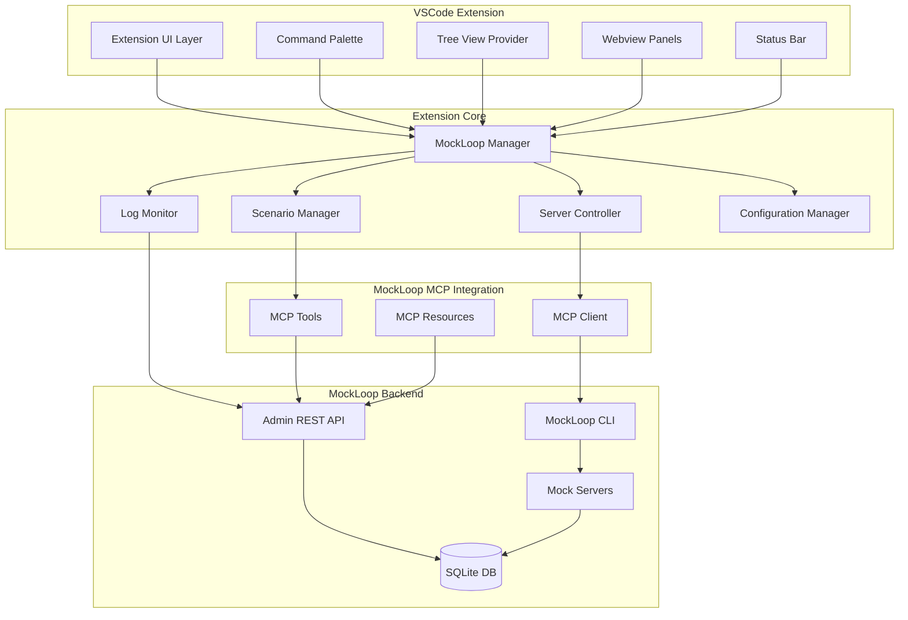
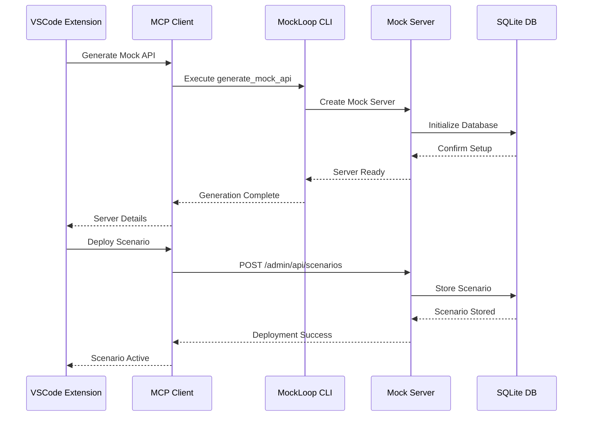

# MockLoop VSCode Extension - Technical Architecture Plan

## Executive Summary

The MockLoop VSCode extension will provide a comprehensive interface to the MockLoop MCP ecosystem, serving developers, testers, and API architects with an intuitive VSCode-integrated experience for mock API generation, scenario management, and testing workflows.

## Architecture Overview



## Core Components

### 1. Extension UI Layer
- **Tree View Provider**: Hierarchical view of mock servers, scenarios, and logs
- **Webview Panels**: Rich UI for server management, scenario editing, and analytics
- **Command Palette**: Quick access to all MockLoop operations
- **Status Bar**: Real-time server status and quick actions

### 2. MockLoop Manager (Core Controller)
- **Server Lifecycle Management**: Start/stop/restart mock servers
- **MCP Integration**: Interface with MockLoop MCP tools and resources
- **Configuration Management**: Handle extension and server configurations
- **Event Coordination**: Manage communication between UI components

### 3. Server Controller
- **Discovery**: Auto-detect running MockLoop servers
- **Generation**: Create new mock APIs from OpenAPI specs
- **Monitoring**: Track server health and performance
- **Port Management**: Handle dual-port architecture (business + admin)

### 4. Scenario Manager
- **CRUD Operations**: Create, read, update, delete scenarios
- **Template Library**: Pre-built scenario templates
- **Validation**: Scenario configuration validation
- **Deployment**: Deploy scenarios to running servers

## Feature Specifications

### Phase 1: Core Features (MVP)

#### 1.1 Mock Server Management
```typescript
interface MockServer {
  id: string;
  name: string;
  status: 'running' | 'stopped' | 'error';
  businessPort: number;
  adminPort?: number;
  apiSpec: OpenAPISpec;
  generatedPath: string;
  createdAt: Date;
}
```

**Features:**
- Generate mock API from OpenAPI spec (file/URL)
- Start/stop/restart servers
- View server logs in real-time
- Server health monitoring
- Quick access to admin UI

#### 1.2 Scenario Management
```typescript
interface Scenario {
  id: string;
  name: string;
  type: 'load_testing' | 'error_simulation' | 'functional_testing';
  config: ScenarioConfig;
  serverId: string;
  isActive: boolean;
}
```

**Features:**
- Create scenarios from templates
- Edit scenario configurations
- Switch active scenarios
- Validate scenario configs
- Import/export scenarios

#### 1.3 Log Monitoring
```typescript
interface LogEntry {
  id: number;
  timestamp: string;
  method: string;
  path: string;
  statusCode: number;
  responseTime: number;
  clientHost: string;
}
```

**Features:**
- Real-time log streaming
- Log filtering and search
- Export logs to various formats
- Performance metrics visualization

### Phase 2: Advanced Features

#### 2.1 Testing Workflows
- **Test Plan Execution**: Run comprehensive test plans
- **Load Testing**: Execute load tests with configurable parameters
- **Security Testing**: Run security vulnerability assessments
- **Performance Analysis**: Detailed performance metrics and trends

#### 2.2 Proxy Mode Support
- **Hybrid Testing**: Compare mock vs live API responses
- **Proxy Configuration**: Set up proxy mode for existing APIs
- **Response Validation**: Validate responses against OpenAPI specs
- **Difference Reporting**: Highlight discrepancies between mock and live

#### 2.3 Advanced Analytics
- **Performance Dashboards**: Real-time performance monitoring
- **Test Result Analysis**: Comprehensive test result analysis
- **Trend Analysis**: Historical performance trends
- **Custom Reports**: Generate custom test reports

### Phase 3: Enterprise Features

#### 3.1 Team Collaboration
- **Scenario Sharing**: Share scenarios across team members
- **Version Control**: Track scenario changes
- **Team Workspaces**: Shared team configurations
- **Access Control**: Role-based access to features

#### 3.2 CI/CD Integration
- **Pipeline Integration**: Integrate with CI/CD pipelines
- **Automated Testing**: Schedule automated test runs
- **Notification System**: Alert on test failures
- **API Monitoring**: Continuous API monitoring

## Technical Implementation

### Extension Structure
```
mockloop-vscode/
├── src/
│   ├── extension.ts              # Main extension entry point
│   ├── managers/
│   │   ├── MockLoopManager.ts    # Core manager
│   │   ├── ServerController.ts   # Server management
│   │   ├── ScenarioManager.ts    # Scenario operations
│   │   └── LogMonitor.ts         # Log monitoring
│   ├── providers/
│   │   ├── TreeViewProvider.ts   # Tree view implementation
│   │   ├── WebviewProvider.ts    # Webview panels
│   │   └── StatusBarProvider.ts  # Status bar integration
│   ├── services/
│   │   ├── MCPClient.ts          # MCP integration
│   │   ├── ConfigService.ts      # Configuration management
│   │   └── FileService.ts        # File operations
│   ├── types/
│   │   ├── MockLoop.ts           # Type definitions
│   │   └── VSCode.ts             # VSCode-specific types
│   └── webviews/
│       ├── server-management/    # Server management UI
│       ├── scenario-editor/      # Scenario editing UI
│       ├── log-viewer/           # Log viewing UI
│       └── analytics/            # Analytics dashboard
├── resources/
│   ├── icons/                    # Extension icons
│   └── templates/                # Scenario templates
├── package.json                  # Extension manifest
└── README.md                     # Documentation
```

### Key Dependencies
```json
{
  "dependencies": {
    "@types/vscode": "^1.74.0",
    "axios": "^1.6.0",
    "ws": "^8.14.0",
    "yaml": "^2.3.0",
    "ajv": "^8.12.0"
  }
}
```

### MCP Integration Points

#### 1. Server Management
```typescript
// Use MCP tools for server operations
await mcpClient.useTool('generate_mock_api', {
  spec_url_or_path: specPath,
  output_dir_name: serverName,
  auth_enabled: true,
  admin_ui_enabled: true
});
```

#### 2. Scenario Operations
```typescript
// Deploy scenarios using MCP tools
await mcpClient.useTool('deploy_scenario', {
  server_url: serverUrl,
  scenario_config: scenarioConfig,
  validate_before_deploy: true
});
```

#### 3. Log Monitoring
```typescript
// Query logs using MCP tools
const logs = await mcpClient.useTool('query_mock_logs', {
  server_url: serverUrl,
  limit: 100,
  analyze: true
});
```

## Integration Architecture

### MockLoop MCP Communication


### Configuration Management
```typescript
interface ExtensionConfig {
  mockloop: {
    cliPath?: string;
    defaultPorts: {
      business: number;
      admin: number;
    };
    autoStart: boolean;
    logLevel: 'debug' | 'info' | 'warn' | 'error';
    templates: {
      scenarioTemplatesPath?: string;
      customTemplates: ScenarioTemplate[];
    };
  };
}
```

## Available MockLoop MCP Capabilities

### Core Tools Available
1. **generate_mock_api**: Generate FastAPI mock servers from OpenAPI specs
2. **query_mock_logs**: Query and analyze request logs with filtering
3. **discover_mock_servers**: Discover running MockLoop servers
4. **manage_mock_data**: Manage dynamic response data and scenarios
5. **validate_scenario_config**: Validate scenario configurations
6. **deploy_scenario**: Deploy scenarios to MockLoop servers
7. **switch_scenario**: Switch active scenarios
8. **list_active_scenarios**: List all active scenarios across servers
9. **execute_test_plan**: Execute comprehensive test plans
10. **run_test_iteration**: Execute single test iterations with monitoring
11. **run_load_test**: Execute load testing with configurable parameters
12. **run_security_test**: Execute security testing scenarios
13. **analyze_test_results**: Analyze test results and provide insights
14. **generate_test_report**: Generate formatted test reports
15. **compare_test_runs**: Compare multiple test runs
16. **get_performance_metrics**: Retrieve and analyze performance metrics

### MCP Resources Available
- **Scenario Packs**: Pre-built scenario templates for various testing types
  - Error simulation (4xx, 5xx, timeouts, rate limiting)
  - Performance testing (load, stress, spike, endurance)
  - Security testing (auth bypass, injection attacks, XSS, CSRF)
  - Business logic testing (edge cases, data validation, workflows)

### Proxy Capabilities
- **Mock Mode**: Pure mock server functionality
- **Proxy Mode**: Forward requests to live APIs
- **Hybrid Mode**: Compare mock vs live API responses
- **Authentication**: Support for various auth types (API key, OAuth2, etc.)
- **Response Validation**: Validate against OpenAPI specifications

## User Experience Design

### 1. Developer Workflow
1. **Quick Start**: Right-click OpenAPI file → "Generate Mock API"
2. **Server Management**: View/manage servers in sidebar tree
3. **Live Logs**: Monitor requests in real-time panel
4. **Quick Actions**: Start/stop servers from status bar

### 2. Tester Workflow
1. **Scenario Creation**: Use scenario editor with templates
2. **Test Execution**: Run load/security tests from command palette
3. **Results Analysis**: View detailed analytics in webview
4. **Report Generation**: Export test results and reports

### 3. Architect Workflow
1. **API Design**: Generate mocks for API prototyping
2. **Validation**: Compare mock vs live API responses
3. **Documentation**: Generate API documentation from scenarios
4. **Team Sharing**: Share configurations and scenarios

## Implementation Phases

### Phase 1 (MVP) - 4-6 weeks
- Basic server management (generate, start, stop)
- Simple scenario management
- Log viewing
- Tree view provider
- Command palette integration

**Key Features:**
- Generate mock APIs from OpenAPI specs
- Start/stop/restart mock servers
- View server status and basic logs
- Simple scenario switching
- Basic tree view with servers and scenarios

### Phase 2 (Advanced) - 6-8 weeks
- Advanced testing workflows
- Proxy mode support
- Analytics dashboard
- Webview panels
- Real-time monitoring

**Key Features:**
- Load testing and security testing
- Hybrid mode with response comparison
- Rich webview panels for management
- Real-time log streaming
- Performance analytics dashboard

### Phase 3 (Enterprise) - 8-10 weeks
- Team collaboration features
- CI/CD integration
- Advanced reporting
- Performance optimization
- Documentation and tutorials

**Key Features:**
- Scenario sharing and version control
- CI/CD pipeline integration
- Advanced test result analysis
- Custom report generation
- Team workspace management

## Technical Considerations

### Performance
- **Lazy Loading**: Load servers and scenarios on demand
- **Caching**: Cache server status and configurations
- **Streaming**: Use WebSocket for real-time log streaming
- **Debouncing**: Debounce UI updates for better performance

### Security
- **Credential Management**: Secure storage of API keys and tokens
- **Validation**: Validate all user inputs and configurations
- **Sandboxing**: Isolate mock server processes
- **Audit Logging**: Track all extension operations

### Extensibility
- **Plugin Architecture**: Support for custom scenario templates
- **API Hooks**: Provide extension points for third-party integrations
- **Theme Support**: Respect VSCode theme settings
- **Accessibility**: Full accessibility compliance

### Error Handling
- **Graceful Degradation**: Handle MCP server unavailability
- **User Feedback**: Clear error messages and recovery suggestions
- **Retry Logic**: Automatic retry for transient failures
- **Logging**: Comprehensive logging for debugging

## Integration with Existing MockLoop MCP Features

### Server Architecture Support
- **Dual-Port Architecture**: Support for separate business and admin ports
- **Single-Port Legacy**: Backward compatibility with legacy servers
- **Auto-Discovery**: Automatic detection of running servers
- **Health Monitoring**: Continuous health checks

### Scenario Management Integration
- **Template System**: Leverage existing scenario pack resources
- **Validation**: Use MCP validation tools for scenario configs
- **Deployment**: Seamless deployment through MCP tools
- **Monitoring**: Real-time scenario performance monitoring

### Testing Workflow Integration
- **Test Plans**: Execute comprehensive test plans via MCP
- **Load Testing**: Leverage advanced load testing capabilities
- **Security Testing**: Integrate security vulnerability assessments
- **Result Analysis**: Use MCP analysis tools for insights

## Success Metrics

### Developer Adoption
- Time to generate first mock API (target: < 30 seconds)
- Daily active users
- Mock API generation frequency
- User retention rate

### Feature Usage
- Scenario creation and deployment frequency
- Test execution volume
- Log monitoring usage
- Advanced feature adoption rate

### Performance
- Extension startup time (target: < 2 seconds)
- Server discovery time (target: < 5 seconds)
- Log streaming latency (target: < 100ms)
- Memory usage optimization

## Future Enhancements

### Advanced Features
- **AI-Powered Scenario Generation**: Use AI to generate test scenarios
- **Visual Scenario Builder**: Drag-and-drop scenario creation
- **Advanced Analytics**: Machine learning for performance insights
- **Multi-Cloud Support**: Support for cloud-based mock servers

### Integration Opportunities
- **Postman Integration**: Import/export Postman collections
- **Swagger Hub**: Direct integration with Swagger Hub
- **GitHub Actions**: Native GitHub Actions support
- **Docker Integration**: Container-based mock server deployment

This comprehensive architecture provides a solid foundation for building a powerful MockLoop VSCode extension that serves developers, testers, and API architects with an intuitive and feature-rich experience.